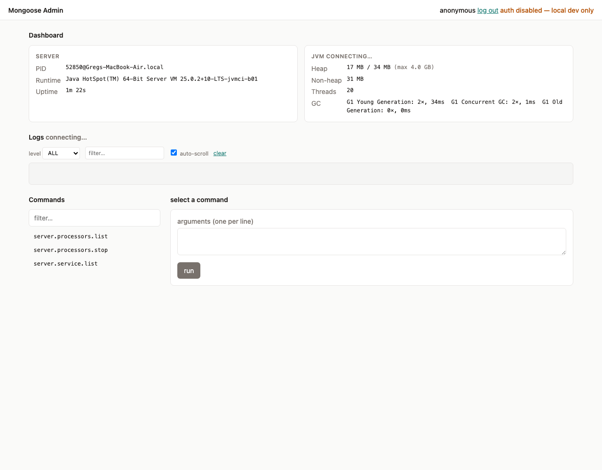

# svc-admin-web

<span class="plugin-tags">
  <span class="plugin-tag service">service</span>
</span>

Browser-based admin & monitoring console for a running Mongoose server. Presentation layer over `AdminCommandRegistry` — the same command surface that `svc-admin-telnet` and `svc-admin-rest` drive — plus a dashboard, live JVM monitor over WebSocket, and a streaming log tail.

Frontend is plain HTML/CSS/JS with [htmx 2.0.4](https://htmx.org) + [Alpine.js 3.14.8](https://alpinejs.dev) vendored under `/vendor/`. Single jar, no Node toolchain, works offline.



```xml
<dependency>
    <groupId>com.telamin</groupId>
    <artifactId>svc-admin-web</artifactId>
    <version>{{ plugin_version }}</version>
</dependency>
```

## What you get

- **Dashboard** — server identity (pid, runtime, uptime) and live JVM stats (heap, non-heap, threads, GC) pushed over WebSocket.
- **Commands** — filterable list of every command registered with `AdminCommandRegistry`, args form, captured stdout/stderr, replay-able history.
- **Logs** — bounded ring buffer of recent `java.util.logging` records streamed live; level filter, substring filter, auto-scroll.
- **Cache panel** (conditional) — when `cache.*` commands are present, surfaces `cache.list`, `cache.{name}.keys`, `cache.{name}.get` as inline forms.
- **Loader panel** (conditional) — when `yamlLoader.*` or `springLoader.*` commands are present, surfaces `compileProcessor` forms with a file picker scoped to `loaderBaseDir`.

Panels are pure discovery — no hard dependency on `svc-cache` or the loaders.

## Endpoints

| Method | Path                       | Auth        | Effect                                          |
|--------|----------------------------|-------------|-------------------------------------------------|
| `GET`  | `/healthz`                 | _none_      | Liveness probe — always `200 OK`                |
| `GET`  | `/`                        | _SPA_       | SPA shell (`index.html` + `/app.js` + `/style.css`) |
| `GET`  | `/api/commands`            | yes         | Lists registered admin commands                 |
| `POST` | `/api/commands/{name}`     | yes + CSRF  | Invokes an admin command                        |
| `GET`  | `/api/server`              | yes         | Server identity (pid, runtime, startTime)       |
| `GET`  | `/api/jvm`                 | yes         | One-shot JVM snapshot                           |
| `GET`  | `/api/files`               | yes         | File-picker entries; `404` when `loaderBaseDir` unset |
| `POST` | `/api/session/login`       | _per mode_  | Exchanges credentials for an HMAC-signed cookie + CSRF token |
| `POST` | `/api/session/logout`      | yes + CSRF  | Invalidates the session cookie                  |
| `WS`   | `/ws/monitor`              | yes + CSRF  | Pushes JVM snapshots at `metricsIntervalMs`     |
| `WS`   | `/ws/logs`                 | yes + CSRF  | Replays buffered log records, then pushes live  |

CSRF on WebSocket upgrades is carried as `?csrf=...` query param (browsers cannot add headers to the WS handshake).

## Sample

```yaml
services:
  - name: adminWebService
    service: !!com.telamin.mongoose.plugin.svc.adminweb.WebAdminService
      host: 127.0.0.1
      listenPort: 8181
      authMode: BASIC
      username: $ENV.ADMIN_USER
      password: $ENV.ADMIN_PASSWORD
      realm: mongoose-admin
      sessionSecret: $ENV.MONGOOSE_ADMIN_SESSION_SECRET
      sessionMinutes: 60
      metricsIntervalMs: 1000
      logTailBuffer: 500
      loaderBaseDir: /etc/mongoose/configs
```

Then point a browser at `http://127.0.0.1:8181/`.

## Authentication

| `authMode`        | Required config        | Browser flow                                                       |
|-------------------|------------------------|--------------------------------------------------------------------|
| `NONE` (default)  | —                      | UI shows an "auth disabled" warning; anonymous session for CSRF    |
| `BASIC`           | `username`, `password` | Sign-in form; backend accepts `Authorization: Basic`               |
| `BEARER`          | `bearerToken`          | Token field; backend accepts `Authorization: Bearer`               |

- Credentials, bearer token, and `sessionSecret` all support `$ENV.NAME` resolution.
- Comparisons are constant-time.
- `init()` fails fast with `IllegalStateException` if you select `BASIC`/`BEARER` but leave credentials empty.
- Sessions are HMAC-signed cookies (`HttpOnly`, `SameSite=Strict`, `Secure` when behind TLS). No server-side session table; restart invalidates all sessions unless `sessionSecret` is pinned via env.
- WS upgrades enforce the same auth + an `Origin` allow-list (same host:port by default).

## Security model

- **CSRF** — every state-changing request must carry `X-CSRF-Token` matching the token in the session cookie. WS upgrades carry it as `?csrf=...`.
- **Origin allow-list** — WS upgrades reject `Origin` headers that don't match the configured bind host:port.
- **Path traversal** — `/api/files` rejects absolute paths and `..` segments at the front gate; after `resolve` it re-checks with `toRealPath()` + `startsWith(base)` to catch symlink escapes.

## Configuration reference

| Field               | Default            | Notes                                                          |
|---------------------|--------------------|----------------------------------------------------------------|
| `host`              | `127.0.0.1`        | Bind address — defaults to loopback                            |
| `listenPort`        | `8181`             | TCP port                                                       |
| `basePath`          | `/`                | Mount point for the SPA                                        |
| `authMode`          | `NONE`             | `NONE`, `BASIC`, `BEARER`                                      |
| `username`          | _unset_            | BASIC credential (`$ENV.` resolvable)                          |
| `password`          | _unset_            | BASIC credential (`$ENV.` resolvable)                          |
| `bearerToken`       | _unset_            | BEARER credential (`$ENV.` resolvable)                         |
| `realm`             | `mongoose-admin`   | `WWW-Authenticate` realm                                       |
| `sessionSecret`     | _random per-JVM_   | HMAC key (`$ENV.` resolvable). Pin to survive restarts.        |
| `sessionMinutes`    | `60`               | Cookie lifetime                                                |
| `metricsIntervalMs` | `1000`             | Sampler period (clamped ≥ 250 ms)                              |
| `logTailBuffer`     | `500`              | Max retained log records                                       |
| `loaderBaseDir`     | _unset_            | Root for the file picker. Unset → `/api/files` returns `404`.  |

## Operational notes

- Implements `EventFlowService<Object>` but is not an event source — `subscribe`/`unSubscribe`/`setEventToQueuePublisher` are no-ops.
- Default `host` is `127.0.0.1`. For multi-host access, change explicitly and front with TLS.
- Javalin uses SLF4J; add a binding (e.g. `log4j-slf4j2-impl`) to silence "no logger" notices in production.

## Examples

- **[mongoose-plugins/example/admin-web-example](https://github.com/telaminai/mongoose-plugins/tree/main/example/admin-web-example)** — standalone boot harness with `AdminCommandProcessor` + `MongooseServerAdmin` so the UI has three real commands on first run.

## Source

[`mongoose-plugins/service/svc-admin-web`](https://github.com/telaminai/mongoose-plugins/tree/main/service/svc-admin-web)
