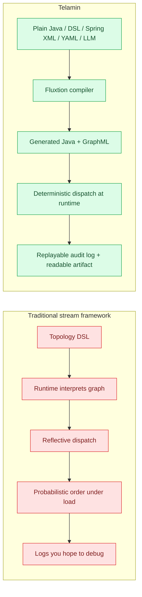
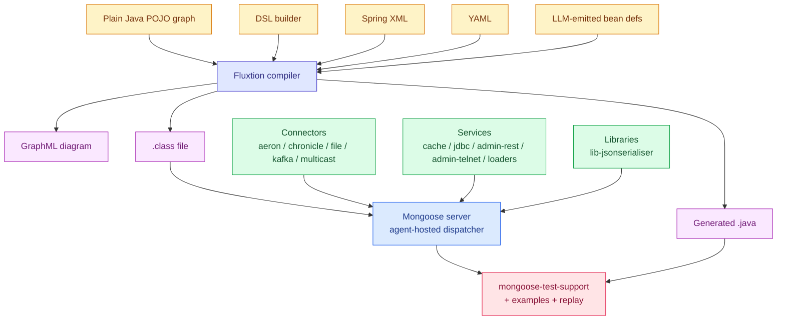
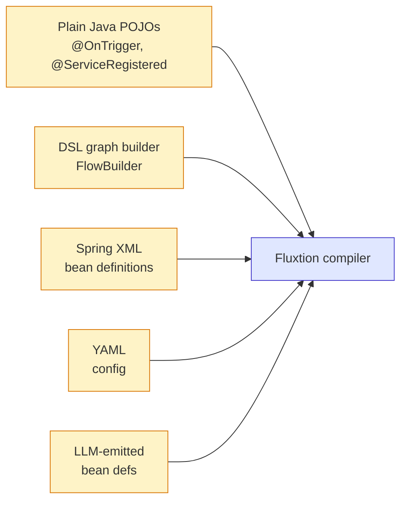
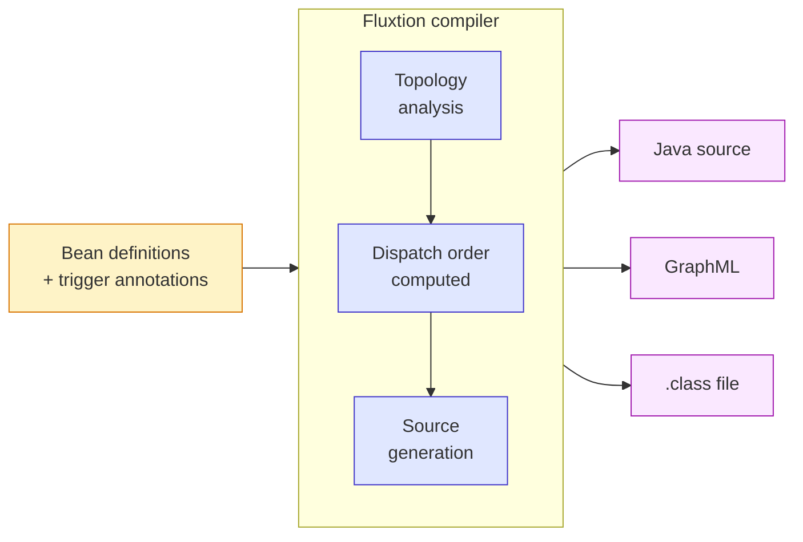
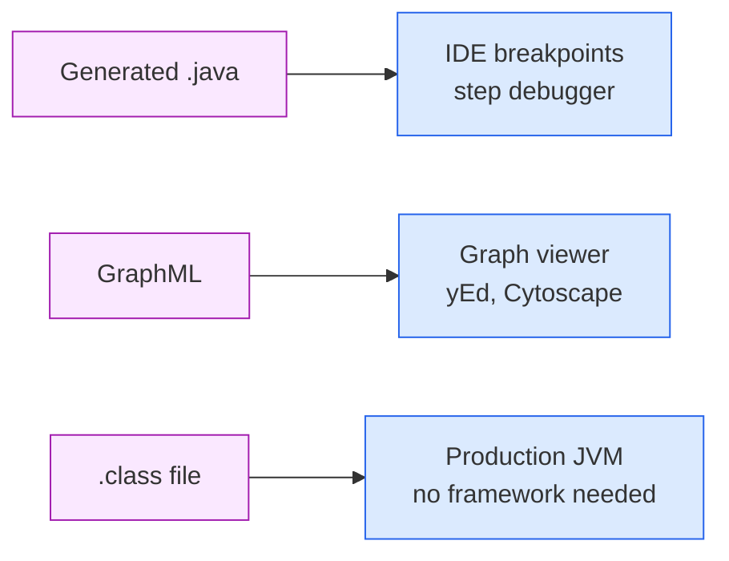
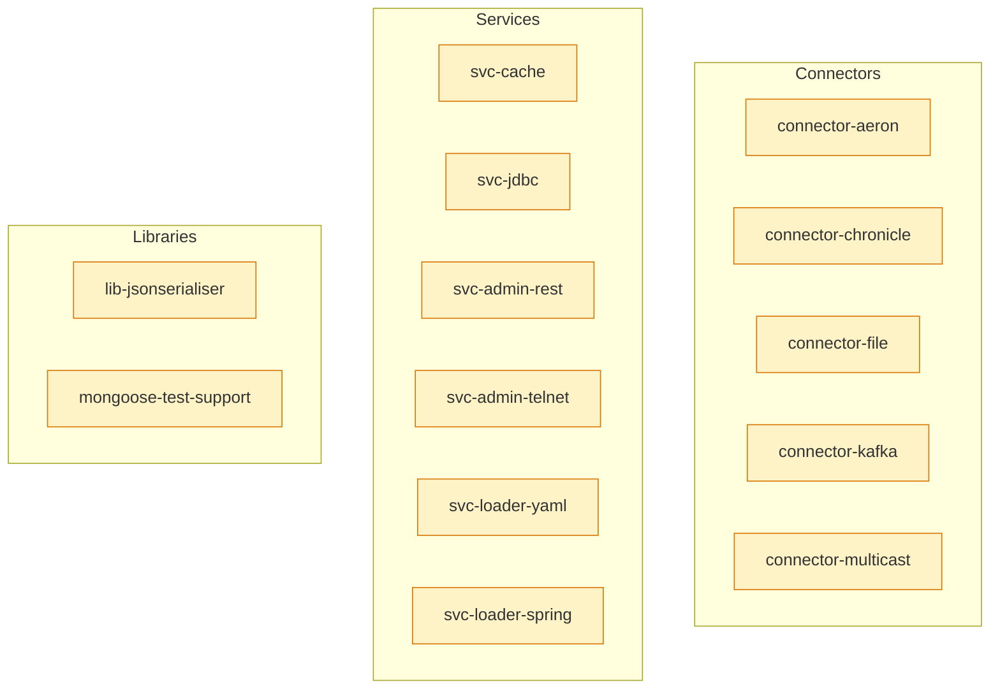
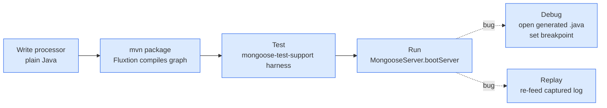
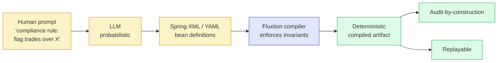
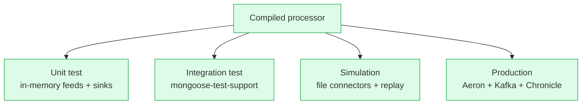

---
hide:
  - toc
---

# The Telamin Stack

<p class="lede" style="font-size:1.25rem; color: var(--md-default-fg-color--light); margin: 0 0 2rem; line-height:1.5;">
A deterministic event-processing stack. The processor is a compiled artifact —
not a runtime interpretation of a topology. Audit, replay, testing, debugging,
and LLM authoring fall out of that single design choice.
</p>

---

## Why this exists

Traditional event-processing stacks force you to pick two of three:

- **Speed** — raw threads and lock-free queues, but no audit trail and you can't reproduce a production bug.
- **Safety** — heavyweight cluster framework with snapshots and exactly-once, but the code path is opaque and the dependencies are vast.
- **Flexibility** — orchestrator-of-orchestrators (Camel, Spring Integration), but you give up performance and deterministic ordering.

Telamin's premise: **compile the event processor**, and you get all three.



The rest of this page walks through the stack layer by layer. Each layer
states **what you get** and **what traditional systems do instead**.

---

## The full stack at a glance



Six layers, each with a clear job. Each layer is also independently
useful — you can stop at Layer 3 if you only need the compiled processor.

---

## Layer 1 — Authoring



**The Fluxtion compiler accepts a logical model of the graph in multiple
authoring shapes.** Plain Java POJOs are the most common form — annotate
methods with `@OnTrigger`, declare dependencies by field reference, and
the compiler infers the dispatch graph. The same compiler also accepts
DSL builders, Spring XML bean definitions, YAML config, and any other
shape that emits compatible bean definitions — including from an LLM.

### What you get

- **Authoring decoupled from runtime.** The same processor can be authored
  five different ways. The runtime doesn't know or care.
- **No framework inheritance required.** Your nodes are plain POJOs. Test
  them with plain JUnit, no special harness for unit-level tests.
- **External authoring tools are first-class.** Spring XML is a carrier for
  any GUI / drag-and-drop / regulated-industry tool that emits bean
  definitions. The LLM authoring pattern (patented, provisional) rides
  on this same surface.

### What traditional systems do instead

- **Frameworks force a specific DSL.** Kafka Streams = Kafka Streams DSL.
  Flink = Flink job graph. Akka = actor protocol.
- **Authoring couples to runtime.** The topology only makes sense inside
  the framework's cluster.
- **No notion of "same graph, different authoring shape."** Migrating
  authoring tooling means rewriting the topology.

---

## Layer 2 — Compilation



The compiler does what compilers do — analyse the graph for cycles and
dependencies, compute the dispatch order at compile time, and emit
artifacts. The dispatch order is a fixed property of the compiled output.

### What you get

- **Deterministic dispatch order.** Two events that arrive in order A→B
  always trigger the handler chain in the same order. No runtime
  polymorphism, no hash-table-iteration luck.
- **A diagram of the actual code path.** GraphML is generated from the
  same analysis that generates the dispatch — it can't drift from the
  code, because it _is_ the code.
- **A Java artifact, not a runtime config.** No "topology loader" inside
  the JVM — the topology IS the JVM code.

### What traditional systems do instead

- **Reflective dispatch at runtime.** Each event triggers a per-event
  decision: which subscribers? In what order?
- **Diagram drift.** Architecture diagrams in Confluence stop matching
  the code two sprints in.
- **Topology lifted from config at startup.** Bugs in the topology only
  surface after the cluster boots — and only on the production data path.

---

## Layer 3 — Runtime artifact



The output of compilation is **three artifacts**: a Java source file
(readable), a GraphML file (visualisable), and a compiled `.class` file
(runnable). They're the same model in three shapes.

### What you get

- **Audit-by-construction.** Every event has a single deterministic
  causal chain through the graph. You don't have to log it — the dispatch
  order is a fixed property of the artifact.
- **Replayable.** Record the events that arrived on the input feeds.
  Re-feed the recording to the same artifact → identical processor state.
  Bit-exact, every time.
- **Debuggable with real tools.** Open the generated `.java` in IntelliJ.
  Set a breakpoint on the dispatch line. Step through. No framework code
  to wade through — the entry point is the next call.
- **No framework lock-in.** The compiled artifact runs in any JVM. You
  could run it in a Lambda. You could embed it in a desktop app.

### What traditional systems do instead

- **Audit = parse logs and guess.** "Why did this event lead to that
  state change?" requires correlating across distributed logs and hoping
  the timestamps make sense.
- **Replay = cluster snapshot + prayer.** Flink savepoints are real but
  expensive and they don't give you _why_, only _what_.
- **Debugging = read framework code.** Step through Spring's
  `DispatcherServlet` or Akka's actor mailbox to find your code. Mostly
  not your code.

---

## Layer 4 — Mongoose server

```mermaid
flowchart TB
    classDef in fill:#fef3c7,stroke:#d97706
    classDef disp fill:#dbeafe,stroke:#2563eb
    classDef out fill:#dcfce7,stroke:#16a34a
    classDef svc fill:#ddd6fe,stroke:#7c3aed

    F1[Source<br/>connector]:::in
    F2[Source<br/>connector]:::in

    Q1[Queue]:::disp
    Q2[Queue]:::disp

    P[Compiled processor<br/>single-thread<br/>deterministic dispatch]:::disp

    S1[Cache<br/>service]:::svc
    S2[JDBC<br/>service]:::svc

    SK1[Sink]:::out
    SK2[Sink]:::out

    F1 -->|agent thread| Q1
    F2 -->|agent thread| Q2
    Q1 --> P
    Q2 --> P
    P <-->|@ServiceRegistered| S1
    P <-->|@ServiceRegistered| S2
    P --> SK1
    P --> SK2
```

Mongoose is the **production wrapper** around a compiled Fluxtion
processor. It hosts the dispatcher on an Agrona `AgentRunner`, provides
single-writer sink semantics, and exposes the `@ServiceRegistered`
injection point for cross-cutting services.

### What you get

- **Same processor across environments.** Unit test → integration test →
  simulation → production. The processor doesn't change; only the
  deployment knob (which connectors are plugged in) does.
- **A small lifecycle contract.** Four hooks: `init`, `start`, `doWork`,
  `tearDown`. Clear semantics for each. No 7-stage `ApplicationContext`
  ceremony.
- **Single-writer sinks by contract.** The dispatcher serialises
  `sendToSink` calls. Plugin authors don't need locks in user code.
- **Agent-per-component threading.** One agent thread per source / sink /
  service. Easy to reason about, easy to size.

### What traditional systems do instead

- **Coupling.** Kafka Streams ↔ Kafka. Flink topology ↔ Flink cluster.
  "Move to a different runtime" = rewrite.
- **Heavyweight lifecycle.** Spring Boot has 7+ overlapping lifecycle
  hooks. Quarkus has dev-mode-only behaviours. Production looks different
  from your IDE.
- **Threading is opaque.** You don't know which thread runs which
  handler; you find out when you get a `ConcurrentModificationException`
  in production.

---

## Layer 5 — Plugins



The plugins are **independent Maven modules**. Pick the ones you need.
Each pulls in only its own dependencies — `connector-file` is plain JDK,
`connector-aeron` brings Aeron 1.48, `svc-jdbc` brings HikariCP. No
bundled monolith.

### Authoring your own — plain Java, no specialised skills

Writing a plugin is one of the smallest surfaces in the stack. For a new
event source:

```java
public class MyEventSource extends AbstractAgentHostedEventSourceService<MyEvent> {
    public MyEventSource() { super("my-source"); }

    @Override public void onStart() { /* open external resource */ }
    @Override public int doWork() {
        // poll external system, publish events via `output.publish(...)`
        return eventsPublished;
    }
    @Override public void tearDown() { /* close resource */ }
}
```

For a new sink:

```java
public class MySink extends AbstractMessageSink<MyEvent> implements Lifecycle {
    @Override public void init() { /* open */ }
    @Override protected void sendToSink(MyEvent value) { /* write */ }
    @Override public void tearDown() { /* close */ }
}
```

That's it. No annotation processor to run. No special build step. No
framework SPI to register. Drop the jar on the classpath, reference the
class in YAML or Java config, and it boots.

### What you get

- **One Maven module per plugin.** No transitive bloat — your final jar
  is your code + the few deps you actually pulled in.
- **Plain Java authoring.** Extend one abstract class, override two or
  three methods, ship. Five-minute task.
- **Independent versioning.** Update `connector-kafka` without touching
  `svc-cache`.
- **A published catalogue.** Every plugin has a [docs page](connectors/index.md)
  with config table, sample YAML, and a link to a runnable example.

### What traditional systems do instead

- **Spring Boot starters pull 50 transitive deps.** `spring-boot-starter-data-jpa`
  alone brings Hibernate, HikariCP, Spring Data, Spring ORM, JTA — even
  if you only wanted a `Connection`.
- **Quarkus extensions are buildtime compiler plugins.** Authoring one
  feels like writing a small compiler. Not weekend work.
- **"Plugin" often means framework boilerplate + your code + a build
  step.** Mongoose plugins are POJOs.

---

## Layer 6 — Developer workflow



**Day-1 productivity is the goal.** Each step is plain Java tooling. No
new IDE, no new build system, no new test runner.

### What you get

- **5-line integration tests.** `MongooseTestHarness` boots a real server,
  awaits a condition, closes cleanly. No TestContainers, no Docker, no
  cluster boot.
- **Debugger steps into your code.** The generated `.java` is the entry
  point. Set a breakpoint in `dispatchEvent` and step through.
- **Reproducible bugs.** Capture the input event log in production
  (use `connector-file` or `connector-chronicle` as a tap sink). Re-feed
  it locally → identical processor state → identical bug.
- **Plain Maven, plain JUnit.** No `@SpringBootTest`, no `@QuarkusTest`,
  no `@MicronautTest`. JUnit 5 + the harness, that's it.

### What traditional systems do instead

- **Integration tests boot 30-second containers.** `@SpringBootTest`
  brings the whole context up. Quarkus dev-mode helps but only inside
  Quarkus.
- **Bug reproduction = restore production state.** Flink: replay from
  a savepoint and hope nothing's diverged. Akka: god help you.
- **Debugger lands in framework code.** Step through `DispatcherServlet`
  for ten frames before you reach your handler.

---

## LLM-friendly architecture



The Fluxtion compiler accepts logical-model input — Spring XML, YAML,
or any bean-definition shape. An LLM emits intent-shaped XML or YAML;
the compiler enforces determinism on top.

The **LLM does what LLMs do**: synthesise from intent. The **compiler
does what compilers do**: enforce invariants. The combination ships an
event processor that's auditable and replayable _even though it was
authored by a non-deterministic model_.

This pattern is the subject of a provisional patent (12-month conversion
window). It positions Telamin uniquely for regulated-industry agentic AI
workflows where the determinism guarantee matters and a raw LLM call
doesn't cut it.

### What you get

- **LLM authoring without losing determinism.** The output is still a
  deterministic compiled artifact, even though the author was an LLM.
- **Audit trail starts at the prompt.** Human prompt → LLM bean defs →
  compiled artifact → event log. Every step is recorded and reproducible.
- **Same compiler regardless of authoring tool.** An LLM, a drag-and-drop
  GUI, and a human writing XML all hit the same downstream guarantee.

### What traditional systems do instead

- **LLM calls embedded as runtime steps.** The non-determinism leaks into
  every event's processing. No replay. No audit. Bad for regulated work.
- **No bridge between intent-shaped authoring and deterministic execution.**
  You either trust the LLM or rewrite by hand.

---

## Performance

The architecture removes the usual sources of dispatch overhead.

### What's not there (on the hot path)

- **No reflection.** Dispatch is a fixed-shape Java method call. The JIT
  inlines it.
- **No virtual dispatch through framework interfaces.** The compiled
  artifact knows the exact concrete types.
- **No per-event lambda allocation.** This used to be a real bug — fixed
  in mongoose 1.0.8 (`DeadWheelScheduler.onTimerExpiryHandler` cached as
  a `final` field). The pattern is enforced repo-wide now.
- **No locks in user code.** Sinks are single-writer by the dispatcher
  contract. Services are single-thread by agent host.
- **No JSON parsing on the dispatch path.** Wire format choice is the
  user's — use `connector-chronicle` for binary, single-host throughput;
  `connector-aeron` for sub-microsecond IPC.

### What is there

- **Agrona AgentRunner.** Same LMAX-era machinery that powers Aeron.
  Battle-tested, well-understood.
- **Single-writer queues.** Per-source, no contention.
- **Compile-time dispatch.** One virtual call per `@OnTrigger`. Period.
- **Configurable idle strategies.** `SleepingMillisIdleStrategy(1)` is
  the recommended default — sub-millisecond tick latency, well-behaved
  CPU usage. `BusySpinIdleStrategy` is available for trading paths.

### Honest about benchmarks

There's no published benchmark suite yet. The architecture eliminates
the usual overhead sources; throughput numbers will land with the next
release. What we can say today:

- Aeron IPC round-trip in the integration tests: ~10 ms wall-clock
  including embedded driver boot. Steady-state per-event is sub-µs.
- File source tail + handler + file sink: ~50 µs per event on
  unoptimised laptop hardware (driven by file I/O, not dispatch).
- Cache lookup + handler: ~100 ns inclusive (single virtual call).

These are not benchmarks. They're the timings the integration tests
happen to land on. Real numbers will come.

### What traditional systems pay

- **Stream frameworks: 10-100× dispatch overhead.** Reflection,
  serialisation, queue handoff between operator threads.
- **Spring Boot: full ApplicationContext on the request path.** Hundreds
  of nanoseconds per dispatch even after warm-up.
- **Akka: actor mailbox dispatch + serialisation.** Designed for
  resilience, not latency.

---

## What stays constant across the stack



The processor is the **constant**. The plugins are the **variable**.

- Same `@OnTrigger` method runs in a unit test, an integration test, a
  simulation, and production.
- The processor doesn't know which it's in. The plugin set decides.
- No "test config" vs "prod config" duality at the processor level.

This is the property that makes Telamin viable for regulated industries:
the thing under audit is the same code that ran in test, simulation,
and production. There's no migration step where determinism could be
lost.

---

## Honest about the gaps

The architecture is solid. The peripheral toolchain is still maturing.

- **Test harness shipped this week.** The `mongoose-test-support` module
  cuts integration-test boot ceremony to five lines. Brand new.
- **Metrics aren't standardised.** Each plugin exposes `getXxxCount()`
  ad-hoc. Micrometer / OpenTelemetry wiring is on the roadmap.
- **YAML config has no schema.** A typo in a property name silently does
  nothing. Schema generation is plumbing-grade work that hasn't happened
  yet.
- **Native-image (GraalVM) hasn't been tested.** The architecture
  should support it — the compiled artifact is plain Java with no
  reflective dispatch on the hot path — but it's untried.
- **Three Java package namespaces** (legacy `com.fluxtion.dataflow.*`,
  legacy `com.fluxtion.server.*`, canonical `com.telamin.mongoose.*`)
  are mid-consolidation. See the [migration plan](migration.md).

These are catchable in weeks. The dispatcher core — the part that's
hard to get right — is shipped.

---

## Where to go next

| Goal                                              | Read this                                          |
|---------------------------------------------------|----------------------------------------------------|
| See it run in 5 minutes                           | [Getting started](getting-started.md)              |
| Browse the plugin catalogue                       | [Connectors](connectors/index.md) / [Services](services/index.md) |
| Write an integration test that actually works     | [Test harness](test-support.md)                    |
| Learn the threading + lifecycle internals         | [Architecture deep-dive](architecture.md)          |
| Production checklist                              | [Operational guide](operations.md)                 |
| What's stable vs in-flight                        | [Migration & namespaces](migration.md)             |
| Runnable demos                                    | [Examples](examples.md)                            |

---

<p style="text-align:center; color: var(--md-default-fg-color--light); margin-top:3rem;">
<em>The dispatcher is the moat. The rest is good engineering.</em>
</p>
