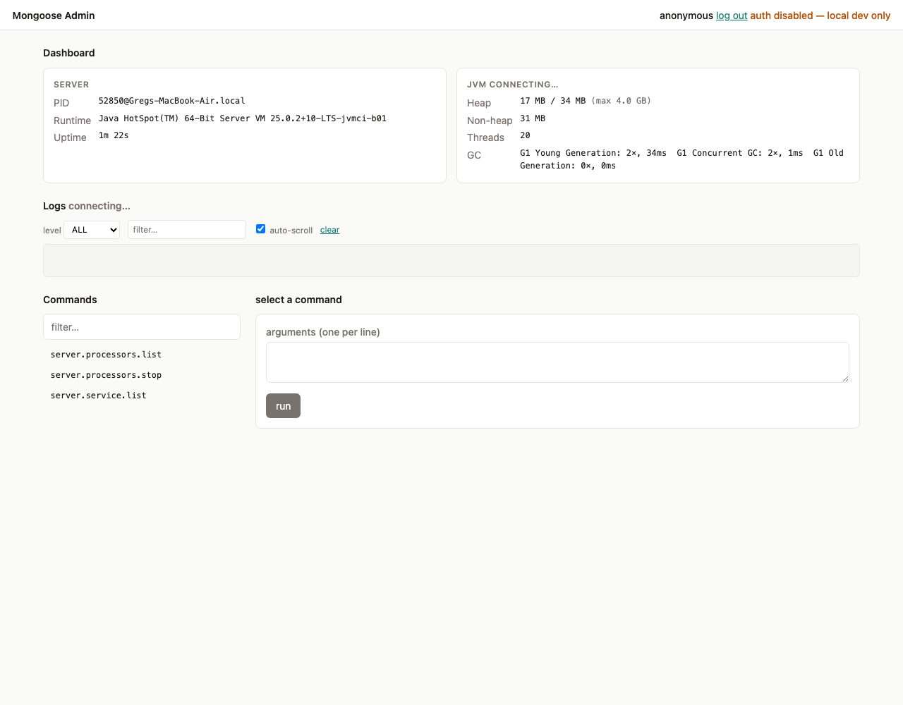

# svc-admin-web

Browser-based admin & monitoring console for a running Mongoose server. Presentation layer over `AdminCommandRegistry` — the same command surface that `svc-admin-telnet` and `svc-admin-rest` drive — plus a dashboard, live JVM monitor, and log tail.

Built against `io.javalin:javalin:6.3.0`. Frontend is plain HTML/CSS/JS with [htmx 2.0.4](https://htmx.org) + [Alpine.js 3.14.8](https://alpinejs.dev) vendored under `/vendor/` (single JAR, no Node toolchain, works offline).



## What you get

- **Dashboard** — server identity (pid, runtime, uptime) and live JVM stats (heap, non-heap, threads, GC counts) pushed over WebSocket at `metricsIntervalMs`.
- **Commands** — filterable list of every command registered with `AdminCommandRegistry`, with an args form, captured stdout/stderr, and a replay-able history.
- **Logs** — bounded ring buffer of recent `java.util.logging` records (debug bridges from SLF4J/Log4j2 to j.u.l flow in too), streamed live over WebSocket; level filter, substring filter, auto-scroll.
- **Cache panel** (conditional) — when `cache.*` commands are present, surfaces `cache.list`, `cache.{name}.keys`, `cache.{name}.get` as inline forms.
- **Loader panel** (conditional) — when `yamlLoader.*` or `springLoader.*` commands are present, surfaces `compileProcessor` forms with an optional file picker scoped to `loaderBaseDir`.

The panels appear automatically when their commands are registered — pure discovery, no hard dependency on `svc-cache` or the loaders.

## Maven coordinates

```xml
<dependency>
    <groupId>com.telamin</groupId>
    <artifactId>svc-admin-web</artifactId>
    <version>0.2.13-SNAPSHOT</version>
</dependency>
```

## Usage — YAML config

```yaml
services:
  - name: adminWebService
    instance: !!com.telamin.mongoose.plugin.svc.adminweb.WebAdminService
      host: 127.0.0.1
      listenPort: 8181
      authMode: BASIC
      username: $ENV.ADMIN_USER
      password: $ENV.ADMIN_PASSWORD
      realm: mongoose-admin
      sessionSecret: $ENV.MONGOOSE_ADMIN_SESSION_SECRET
      sessionMinutes: 60
      metricsIntervalMs: 1000
      logTailBuffer: 500
      loaderBaseDir: /etc/mongoose/configs  # required if loader file-picker enabled
```

Then point a browser at `http://127.0.0.1:8181/`.

## HTTP / WebSocket surface

| Method | Path                       | Auth        | Effect                                      |
|--------|----------------------------|-------------|---------------------------------------------|
| `GET`  | `/healthz`                 | _none_      | Liveness probe — always `200 OK`            |
| `GET`  | `/`                        | _via SPA_   | SPA shell (`index.html` + `/app.js` + `/style.css`) |
| `GET`  | `/api/commands`            | yes         | Lists registered admin commands             |
| `POST` | `/api/commands/{name}`     | yes + CSRF  | Invokes an admin command                    |
| `GET`  | `/api/server`              | yes         | Server identity (pid, runtime, startTime)   |
| `GET`  | `/api/jvm`                 | yes         | One-shot JVM snapshot                       |
| `GET`  | `/api/files`               | yes         | File-picker entries under `loaderBaseDir`; `404` when feature unconfigured |
| `POST` | `/api/session/login`       | _per mode_  | Exchanges credentials for an HMAC-signed cookie + CSRF token |
| `POST` | `/api/session/logout`      | yes + CSRF  | Invalidates the session cookie              |
| `WS`   | `/ws/monitor`              | yes + CSRF  | Pushes JVM snapshots at `metricsIntervalMs` |
| `WS`   | `/ws/logs`                 | yes + CSRF  | Replays buffered log records on connect, then pushes per-record live |

CSRF on WebSocket upgrades is carried as `?csrf=...` query param (browsers cannot add headers to the WS handshake).

## Authentication

| `authMode`        | Required config        | Browser flow                                                       |
|-------------------|------------------------|--------------------------------------------------------------------|
| `NONE` (default)  | —                      | UI shows an "auth disabled" warning; anonymous session for CSRF    |
| `BASIC`           | `username`, `password` | UI renders a sign-in form; backend accepts `Authorization: Basic`  |
| `BEARER`          | `bearerToken`          | UI renders a token field; backend accepts `Authorization: Bearer`  |

- Credentials, bearer token, and `sessionSecret` all support `$ENV.NAME` resolution.
- Comparisons are constant-time.
- `init()` fails fast with `IllegalStateException` if you select `BASIC`/`BEARER` but leave credentials empty.
- Sessions are HMAC-signed cookies (`HttpOnly`, `SameSite=Strict`, `Secure` when behind TLS). There is no server-side session table; restart invalidates all sessions unless `sessionSecret` is pinned via env.
- `WS /ws/*` upgrades enforce the same auth + an `Origin` allow-list (same host:port by default).

## Configuration reference

| Field               | Default            | Notes                                                          |
|---------------------|--------------------|----------------------------------------------------------------|
| `host`              | `127.0.0.1`        | Bind address — defaults to loopback                            |
| `listenPort`        | `8181`             | TCP port                                                       |
| `basePath`          | `/`                | Mount point for the SPA                                        |
| `authMode`          | `NONE`             | `NONE`, `BASIC`, `BEARER`                                      |
| `username`          | _unset_            | BASIC credential (`$ENV.` resolvable)                          |
| `password`          | _unset_            | BASIC credential (`$ENV.` resolvable)                          |
| `bearerToken`       | _unset_            | BEARER credential (`$ENV.` resolvable)                         |
| `realm`             | `mongoose-admin`   | `WWW-Authenticate` realm                                       |
| `sessionSecret`     | _random per-JVM_   | HMAC key (`$ENV.` resolvable). Pin to survive restarts.        |
| `sessionMinutes`    | `60`               | Cookie lifetime                                                |
| `metricsIntervalMs` | `1000`             | Sampler period (clamped ≥ 250 ms)                              |
| `logTailBuffer`     | `500`              | Max retained log records                                       |
| `loaderBaseDir`     | _unset_            | Root for the file picker. Unset → `/api/files` returns `404` and the "browse…" button hides. |

## Security model

- **Auth** — covered above.
- **CSRF** — every state-changing request (`POST`/`PUT`/`PATCH`/`DELETE`) must carry `X-CSRF-Token` matching the token in the session cookie. WS upgrades carry it as `?csrf=...`.
- **Origin allow-list** — WS upgrades reject `Origin` headers that don't match the configured bind host:port. Use a reverse proxy if you need a different external origin.
- **Path traversal** — `/api/files` rejects absolute paths and `..` segments at the front gate; after `resolve` it re-checks with `toRealPath()` + `startsWith(base)` to catch symlink escapes.

## SPA assets

`src/main/resources/web/` contains:

- `index.html` — Alpine root, layout
- `app.js` — Alpine component (`adminApp`), all client logic
- `style.css` — monochrome utility skin
- `vendor/htmx-2.0.4.min.js`, `vendor/alpine-3.14.8.min.js`

Asset load order matters: `app.js` loads **eagerly** (no `defer`) so the `alpine:init` listener attaches before Alpine's deferred CDN build calls `Alpine.start()`.

Total bundle (gzipped) is well under 500 KB; everything is served from the classpath and works offline.

## Operational notes

- Implements `EventFlowService<Object>` to fit the Mongoose service-injection model, but it does not push events into the dispatch pipeline — `subscribe`/`unSubscribe`/`setEventToQueuePublisher` are intentional no-ops.
- Default `host` is `127.0.0.1` (loopback). For multi-host access, change explicitly and front with TLS.
- Javalin uses SLF4J; without a binding you'll see "no logger" notices. Add `org.apache.logging.log4j:log4j-slf4j2-impl` in production.

## Tests

39 tests across:

- `WebAdminServiceTest` (28) — healthz, init fail-fast, BASIC/BEARER, session+CSRF, command list/invoke, `/api/server`, `/api/jvm`, `/api/files` (404, list, traversal, absolute, unauth), WS auth gate, log-tail lifecycle.
- `LogTailTest` (5) — ring-buffer cap, subscriber fan-out, capacity validation, root-logger capture, package self-filter.
- `SessionTokenTest` (6) — round-trip, tampered signature, wrong secret, expired, malformed, pipe-in-input.

## Related

- [`svc-admin-rest`](../svc-admin-rest/) — same command surface, HTTP-only (no SPA, no monitoring, no log tail). Use when you want a smaller, scriptable surface.
- [`svc-admin-telnet`](../svc-admin-telnet/) — same command surface over a telnet line protocol; smallest dependency footprint.
- [`svc-cache`](../svc-cache/), [`svc-loader-yaml`](../svc-loader-yaml/), [`svc-loader-spring`](../svc-loader-spring/) — registering any of these surfaces extra panels in the UI automatically.

For the full design and milestone log, see [`design/svc-admin-web.md`](../../design/svc-admin-web.md).
