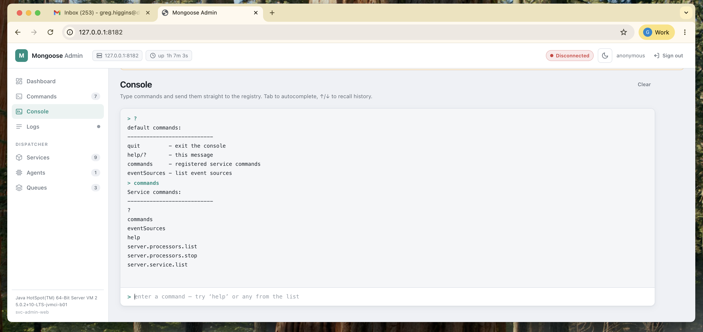
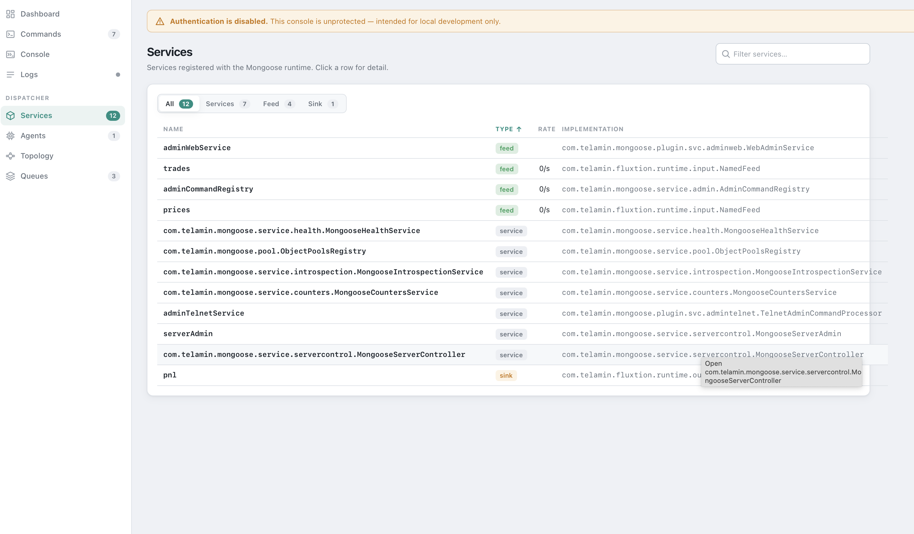
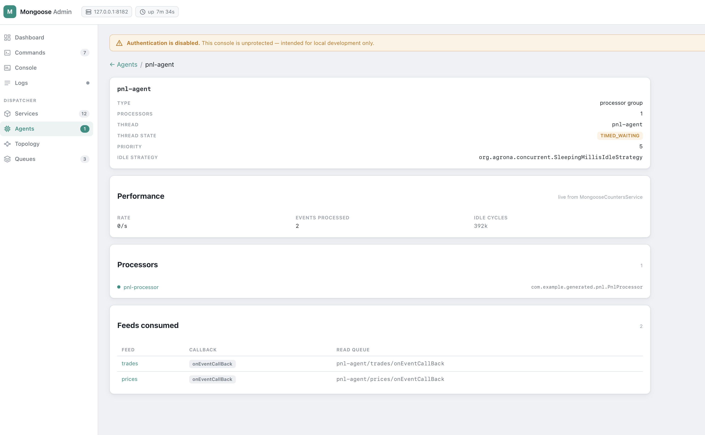
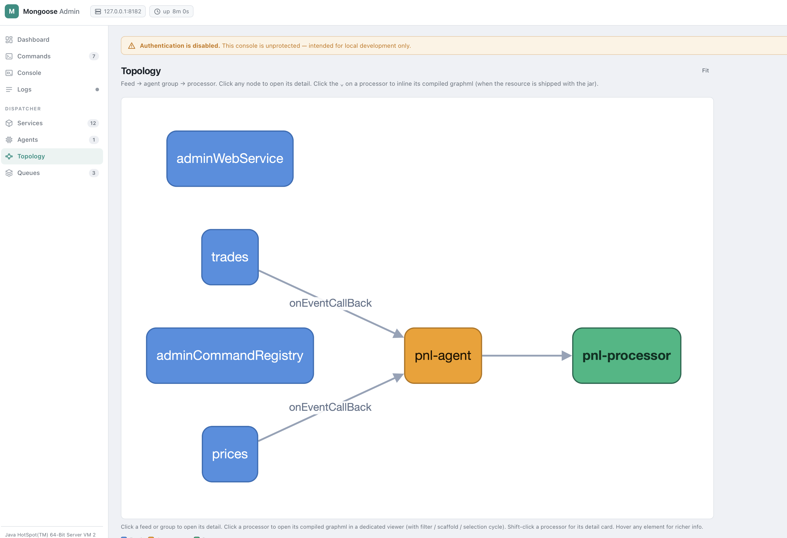
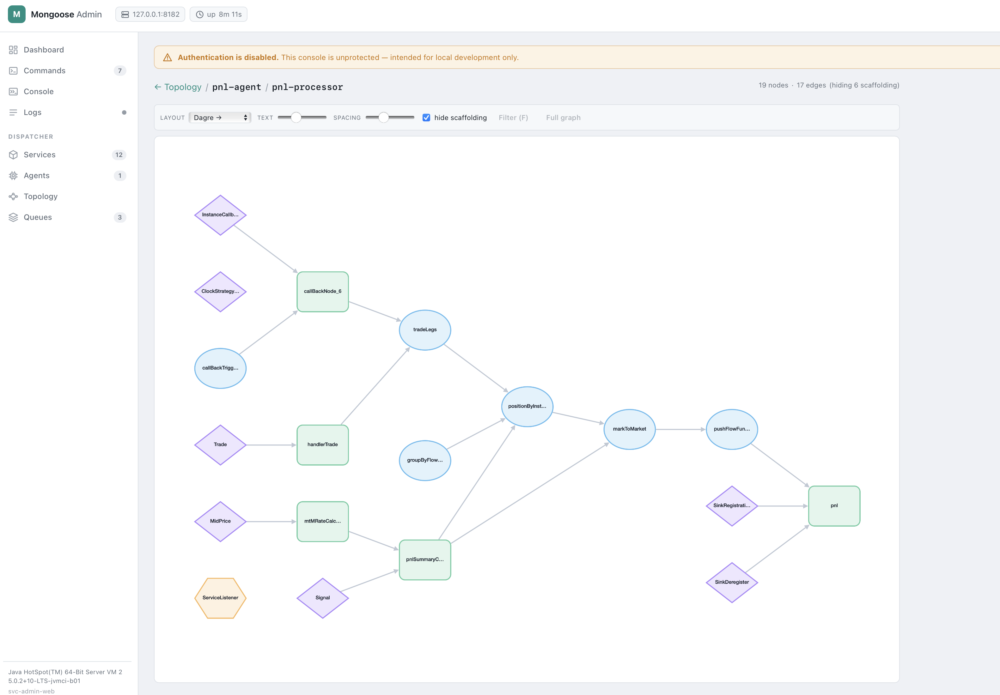

# svc-admin-web

Browser-based admin & monitoring console for a running Mongoose server. Presentation layer over `AdminCommandRegistry` — the same command surface that `svc-admin-telnet` and `svc-admin-rest` drive — plus a dashboard, live JVM monitor, and log tail.

Built against `io.javalin:javalin:6.3.0`. Frontend is plain HTML/CSS/JS with [htmx 2.0.4](https://htmx.org) + [Alpine.js 3.14.8](https://alpinejs.dev) vendored under `/vendor/` (single JAR, no Node toolchain, works offline).


## What you get

A nav-rail console with a light/dark theme toggle — one view at a time, live WebSocket streams running in the background.

- **Dashboard** — server identity (pid, runtime, uptime) and live JVM stats (heap usage meter, heap sparkline, non-heap, threads, GC table) pushed over WebSocket. Includes a **Refresh** dropdown (1 / 2 / 5 / 10 / 30 s + Off) that throttles the server-side `MonitoringSampler` — pick Off and the sampler stops allocating snapshots entirely. When the mongoose server has `performanceMonitoring.enabled: true` set in its YAML, a **Throughput card** appears showing live per-feed / per-agent-group / per-processor rates plus a per-queue depth table — every name is a clickable link into the matching detail page. With `performanceMonitoring` off, the card is replaced with an honest "monitoring is off" hint and the YAML key to flip.
- **Commands** — filterable list of every command registered with `AdminCommandRegistry`, with an args form, captured stdout/stderr, and a replay-able history.
- **Console** — interactive terminal: type commands directly, Tab to autocomplete from the registered command list, ↑/↓ to recall history.

  

- **Logs** — bounded ring buffer of recent `java.util.logging` records (debug bridges from SLF4J/Log4j2 to j.u.l flow in too), streamed live over WebSocket; level filter, substring filter, auto-scroll.
- **Services / Agents / Queues** — dispatcher introspection driven by `MongooseServerController` and (when present) the `MongooseIntrospectionService`. **Services** classifies entries as `feed` / `sink` / `service`, cross-links to consumers, exposes a **Configuration** card (reflective public-getter view of the live instance, sensitive-named values masked), and — when `performanceMonitoring` is on — a new **Rate** column on each feed row plus a **Performance card** on the detail page showing live rate + total published.

  

  **Agents** surfaces thread name + state, idle strategy, per-processor feed subscriptions, an inline rate tag on each card head, and a **Performance card** on the detail page (rate + events processed + idle cycles).

  

  **Queues** renders the live `EventFlowManager` topology with a **Consumer column** linking each queue back to its consuming agent group.
- **Topology** — lazy-loaded cytoscape DAG of `feed → agent group → processor`. Click a feed or group to open its detail; click a processor to drill into its compiled graphml. When `performanceMonitoring` is on, feed and group nodes **pulse green** for ~800 ms each time their rate ticks above zero in the latest sample window — visible heartbeat of the running pipeline.

  

- **Processor graph** — full Fluxtion-style graphml viewer for a single processor: layout switcher, font + spacing sliders, **Hide scaffolding** toggle, click-to-cycle selection (focus → 1-hop neighbours → execution path → whole graph), **Filter (F)** to redraw on the current selection, **Full graph** to clear. Tapping a node also opens a **Source-nav** panel (top-right of the canvas) showing the node id, kind, origin classification (`user` / `mongoose` / `fluxtion` / `fluxtion-runtime`), the class FQN, and a suggested source-path hint (e.g. `com/example/PnlSummaryCalc.java`) — both copyable, so you can paste straight into your IDE's open-file dialog. Esc or background-tap dismisses the panel. The left border is colour-coded by origin so your code stands out from framework nodes. When a `PerformanceMonitorAudit` is bound to the processor at build time, the sub-detail panel shows a **Per-node invocations** table — every node in the generated SEP with its live invocation count. The graphml is loaded from `<class-FQN-with-/>.graphml` on the processor's classloader; a structured "expected `<path>` — copy it into `src/main/resources/...`" panel guides plugin authors when the resource is missing.

  
- **Cache panel** (conditional) — when `cache.*` commands are present, surfaces `cache.list`, `cache.{name}.keys`, `cache.{name}.get` as inline forms.
- **Loader panel** (conditional) — when `yamlLoader.*` or `springLoader.*` commands are present, surfaces `compileProcessor` forms with an optional file picker scoped to `loaderBaseDir`.

Panels are pure discovery — Topology appears when both Services and Agents are available, Cache / Loader appear when their commands are registered. No hard dependency on `svc-cache`, the loaders, or any specific plugin.

## Maven coordinates

```xml
<dependency>
    <groupId>com.telamin</groupId>
    <artifactId>svc-admin-web</artifactId>
    <version>0.2.16-SNAPSHOT</version>
</dependency>
```

## Usage — YAML config

```yaml
services:
  - name: adminWebService
    service: !!com.telamin.mongoose.plugin.svc.adminweb.WebAdminService
      host: 127.0.0.1
      listenPort: 8181
      authMode: BASIC
      username: $ENV.ADMIN_USER
      password: $ENV.ADMIN_PASSWORD
      realm: mongoose-admin
      sessionSecret: $ENV.MONGOOSE_ADMIN_SESSION_SECRET
      sessionMinutes: 60
      metricsIntervalMs: 1000
      logTailBuffer: 500
      loaderBaseDir: /etc/mongoose/configs  # required if loader file-picker enabled
```

Then point a browser at `http://127.0.0.1:8181/`.

## HTTP / WebSocket surface

| Method | Path                                              | Auth        | Effect                                          |
|--------|---------------------------------------------------|-------------|-------------------------------------------------|
| `GET`  | `/healthz`                                        | _none_      | Liveness probe — always `200 OK`                |
| `GET`  | `/`                                               | _via SPA_   | SPA shell (`index.html` + `/app.js` + `/style.css`) |
| `GET`  | `/api/commands`                                   | yes         | Lists registered admin commands                 |
| `POST` | `/api/commands/{name}`                            | yes + CSRF  | Invokes an admin command                        |
| `GET`  | `/api/server`                                     | yes         | Server identity (pid, runtime, startTime)       |
| `GET`  | `/api/jvm`                                        | yes         | One-shot JVM snapshot                           |
| `GET`  | `/api/services`                                   | yes         | Service inventory; feeds carry `consumers`. `404` when no controller is wired. |
| `GET`  | `/api/services/{name}/config`                     | yes         | Reflective public-getter view of a service, sensitive-named values masked |
| `GET`  | `/api/agents`                                     | yes         | Agent groups + processors. Enriched with thread / idle strategy / per-processor subscriptions when introspection is wired. |
| `GET`  | `/api/queues`                                     | yes         | Per-feed read-queue topology from `EventFlowManager` |
| `GET`  | `/api/processors/{group}/{name}/graphml`          | yes         | Compiled Fluxtion graphml for a registered event processor; structured `404` with `expectedResource` + `hint` when the resource isn't shipped |
| `GET`  | `/api/files`                                      | yes         | File-picker entries under `loaderBaseDir`; `404` when feature unconfigured |
| `POST` | `/api/session/login`                              | _per mode_  | Exchanges credentials for an HMAC-signed cookie + CSRF token |
| `POST` | `/api/session/logout`                             | yes + CSRF  | Invalidates the session cookie                  |
| `WS`   | `/ws/monitor`                                     | yes + CSRF  | Pushes JVM snapshots; client controls rate via `{"op":"rate","ms":<n>}` (0 = Off). Server-effective period = `min(client-rates)`, sampler stops when every client is Off. When the mongoose server's `MongooseCountersService` is operational, each frame also carries a `throughput` block: `{feeds, groups, processors, nodes, queues}` with per-counter `{name, rate, total}` (rate = delta / windowMs × 1000). `throughput` is `null` when performance monitoring is disabled. |
| `WS`   | `/ws/logs`                                        | yes + CSRF  | Replays buffered log records on connect, then pushes per-record live |

CSRF on WebSocket upgrades is carried as `?csrf=...` query param (browsers cannot add headers to the WS handshake).

### Graphml resource convention

`GET /api/processors/{group}/{name}/graphml` reads from the processor's own classloader at `<class-FQN-with-slashes>.graphml`. For a processor whose class is `com.example.generated.pnl.PnlProcessor`, ship the file at `src/main/resources/com/example/generated/pnl/PnlProcessor.graphml`. On miss, the 404 body carries `{className, expectedResource, hint}` so the UI can render a guided "copy your generated `.graphml` into `src/main/resources/...`" panel rather than a silent failure.

## Authentication

| `authMode`        | Required config        | Browser flow                                                       |
|-------------------|------------------------|--------------------------------------------------------------------|
| `NONE` (default)  | —                      | UI shows an "auth disabled" warning; anonymous session for CSRF    |
| `BASIC`           | `username`, `password` | UI renders a sign-in form; backend accepts `Authorization: Basic`  |
| `BEARER`          | `bearerToken`          | UI renders a token field; backend accepts `Authorization: Bearer`  |

- Credentials, bearer token, and `sessionSecret` all support `$ENV.NAME` resolution.
- Comparisons are constant-time.
- `init()` fails fast with `IllegalStateException` if you select `BASIC`/`BEARER` but leave credentials empty.
- Sessions are HMAC-signed cookies (`HttpOnly`, `SameSite=Strict`, `Secure` when behind TLS). There is no server-side session table; restart invalidates all sessions unless `sessionSecret` is pinned via env.
- `WS /ws/*` upgrades enforce the same auth + an `Origin` allow-list (same host:port by default).

## Configuration reference

| Field               | Default            | Notes                                                          |
|---------------------|--------------------|----------------------------------------------------------------|
| `host`              | `127.0.0.1`        | Bind address — defaults to loopback                            |
| `listenPort`        | `8181`             | TCP port                                                       |
| `basePath`          | `/`                | Mount point for the SPA                                        |
| `authMode`          | `NONE`             | `NONE`, `BASIC`, `BEARER`                                      |
| `username`          | _unset_            | BASIC credential (`$ENV.` resolvable)                          |
| `password`          | _unset_            | BASIC credential (`$ENV.` resolvable)                          |
| `bearerToken`       | _unset_            | BEARER credential (`$ENV.` resolvable)                         |
| `realm`             | `mongoose-admin`   | `WWW-Authenticate` realm                                       |
| `sessionSecret`     | _random per-JVM_   | HMAC key (`$ENV.` resolvable). Pin to survive restarts.        |
| `sessionMinutes`    | `60`               | Cookie lifetime                                                |
| `metricsIntervalMs` | `1000`             | Sampler period (clamped ≥ 250 ms)                              |
| `logTailBuffer`     | `500`              | Max retained log records                                       |
| `loaderBaseDir`     | _unset_            | Root for the file picker. Unset → `/api/files` returns `404` and the "browse…" button hides. |

## Security model

- **Auth** — covered above.
- **CSRF** — every state-changing request (`POST`/`PUT`/`PATCH`/`DELETE`) must carry `X-CSRF-Token` matching the token in the session cookie. WS upgrades carry it as `?csrf=...`.
- **Origin allow-list** — WS upgrades reject `Origin` headers that don't match the configured bind host:port. Use a reverse proxy if you need a different external origin.
- **Path traversal** — `/api/files` rejects absolute paths and `..` segments at the front gate; after `resolve` it re-checks with `toRealPath()` + `startsWith(base)` to catch symlink escapes.

## SPA assets

`src/main/resources/web/` contains:

- `index.html` — Alpine root, layout
- `app.js` — Alpine component (`adminApp`), all client logic
- `style.css` — utility skin
- `vendor/htmx-2.0.4.min.js`, `vendor/alpine-3.14.8.min.js` — eager
- `vendor/dagre-0.8.5.min.js`, `vendor/cytoscape-3.33.3.min.js`, `vendor/cytoscape-dagre-2.5.0.js` — **lazy**, fetched only on first Topology view open
- `visualiser/graph-parser.js`, `visualiser/scaffold-filter.js`, `visualiser/cytoscape-renderer.js` — lifted from `fluxtion-web/lib/visualiser/`, ES modules consumed by the Processor graph view

Asset load order matters: `app.js` loads **eagerly** (no `defer`) so the `alpine:init` listener attaches before Alpine's deferred CDN build calls `Alpine.start()`. The cytoscape stack and the visualiser modules are only fetched when the user actually enters the Topology / Processor graph views — initial bundle (excluding cytoscape) stays well under 200 KB.

## Operational notes

- Implements `EventFlowService<Object>` to fit the Mongoose service-injection model, but it does not push events into the dispatch pipeline — `subscribe`/`unSubscribe`/`setEventToQueuePublisher` are intentional no-ops.
- Default `host` is `127.0.0.1` (loopback). For multi-host access, change explicitly and front with TLS.
- Javalin uses SLF4J; without a binding you'll see "no logger" notices. Add `org.apache.logging.log4j:log4j-slf4j2-impl` in production.

## Performance monitoring

When the mongoose server is booted with `performanceMonitoring.enabled: true`, svc-admin-web's `MonitoringSampler` walks `MongooseCountersService.forEachCounter` on every tick, computes per-counter rates against the previous snapshot, and bundles the result into the `/ws/monitor` payload's `throughput` field. The Dashboard renders the bundle as the Throughput card; the Services / Agents / Topology / Processor views light up with the per-entity slices.

Counters service is opt-in YAML on the mongoose-core side. See the [mongoose how-to: enabling performance monitoring](https://github.com/telaminai/mongoose/blob/main/docs/example/how-to/how-to-performance-monitoring.md). With monitoring off (the default) the Throughput card is hidden and the WS payload carries `throughput: null` — pure additive behaviour, no impact on existing deployments.

Pre-requisite: mongoose-core ≥ 1.0.13 (counters service introduced in that release).

## Tests

79 tests across three suites:

- `WebAdminServiceTest` (63) — auth fail-fast + BASIC/BEARER, session + CSRF, command list / invoke, `/api/server`, `/api/jvm`, `/api/services` (controller-driven + introspection-driven), `/api/services/{name}/config` (reflection helper + endpoint), `/api/agents` (with introspection-stub thread/idle/subscription enrichment), `/api/queues`, `/api/processors/{group}/{name}/graphml` (hit on classpath, structured 404, unknown group, unknown processor, no controller), `/api/files` (404, list, traversal, absolute, unauth), WS auth gate, `MonitoringSampler` (dynamic interval, paused = zero allocations), log-tail lifecycle.
- `MonitoringSamplerThroughputTest` (5) — no-op service leaves throughput null; label routing into feeds/groups/processors/nodes/queues; rate computes against previous tick delta; counters added mid-life appear on the next tick; legacy `(intervalMs)`-only constructor.
- `LogTailTest` (5) — ring-buffer cap, subscriber fan-out, capacity validation, root-logger capture, package self-filter.
- `SessionTokenTest` (6) — round-trip, tampered signature, wrong secret, expired, malformed, pipe-in-input.

## Related

- [`svc-admin-rest`](../svc-admin-rest/) — same command surface, HTTP-only (no SPA, no monitoring, no log tail). Use when you want a smaller, scriptable surface.
- [`svc-admin-telnet`](../svc-admin-telnet/) — same command surface over a telnet line protocol; smallest dependency footprint.
- [`svc-cache`](../svc-cache/), [`svc-loader-yaml`](../svc-loader-yaml/), [`svc-loader-spring`](../svc-loader-spring/) — registering any of these surfaces extra panels in the UI automatically.

For the full design and milestone log, see [`design/svc-admin-web.md`](../../design/svc-admin-web.md).
